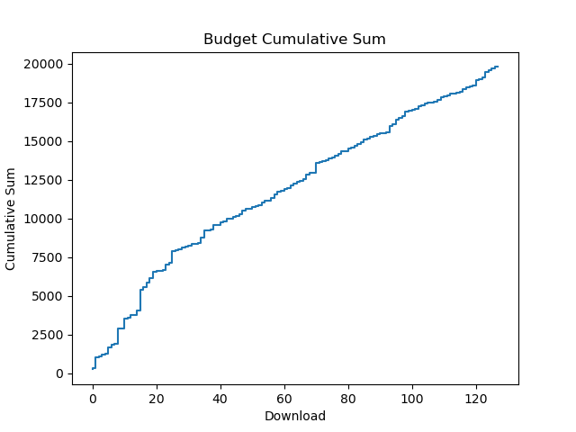
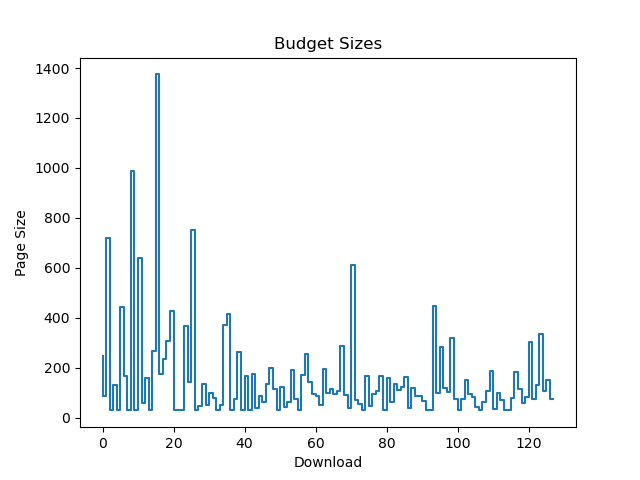
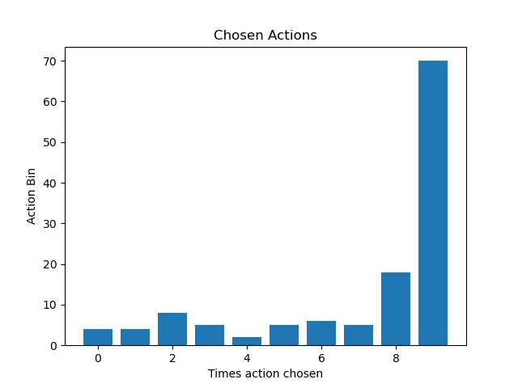

# Crawler-CMAB

## Crawler:

In the file: main.py. There is an example of greedy context guided crawler.
The idea in construct this context guided crawler is to understand what could be used in a CMAB in this situation.
The greedy context guided crawler is divided in these sub-parts:
- Defined a term, we search it on Wikipedia and the budget;
- Check the size of the web page;
- Get all the links;
- Check the embeddings for each link;
- Clean the embeddings (If not found embeddings for each link term, discard it);
- Get the cosine similarity for each term compared with initial term;
- Always get the most similar to the initial one;
- Calculated the action loss;
- Do this until the budget is over.

### Embeddings: 

- Not all words are in the used embedding method.
- First is checked if there is an embedding for the word, if not, check an embedding for an entity.
    - For example, "bmw" (word) and "Bmw" (entity), both were found in this method. However, the embedding are not the same for word and entity, so the first option is to use the word, and if there is no word embedding, use the entity embedding.

### Possible improvements:
- Check a better embedding method.
- Use an elaborated loss function.
- An idea that can be done is defined a term and departing by this term arrive in other specific term. With this idea is easy to define a loss and reward function, always trying to reach the term with minimum steps (clicking links).
- Write more tests to catch futures possible bugs.

## CMAB:

The cmab.py file, there is the CMAB implementation in the crawler. In the challenge file is written that "a CMAB with two actions (or, arms) that chooses to either download a page or not based on the present context". However, I could not understand how to perform the CMAB in this situation.
I create a CMAB, using the idea of the crawler, in the following way:
- All the scraped links from the wiki page are retained in a list of tuples and sorted by the cosine similarity, from the smallest number to the highest, the distance is always calculated based on the initial given term.
- Using this list, I define bins where each arm will work. How I define it? Dividing the list by the quantity of arms.
- The reward is defined as: If distance is bigger than threshold (e.g. 0.3), get the reward!
- The regret is the difference of the distances, distance of the chosen link and the best option at that moment.
- Now we can deduce that the CMAB is \epsilon - greedy and should converge to the last bin.

Here we can see a bit of the performance of the CMAB. 

### Challenges:
- The most difficult thing was realizing how to combine the CMAB with the crawler. It still not clear for me, how to use CMAB with the crawler and make the decisions as the crawler is getting new pages(links).

### Possible Improvements:
- Try to use different CMAB's, I used the greedy. However, I believe that others can have a better result.
- Define a better reward/regret. Depending on the initial term, can happen that CMAB won't converge. And it is explained because of the reward is fixed based on the distances. For example, some words does not have a lot of things related and in this case the similarity of the links probably will be low. Then, if it is smaller than 0.3, no reward.

Obs: 
- I spent about 3 days working on it. 
- I did not manage to test others CMAB's. 
- The GitHub informed in the challenge was really usefull to get the CMAB working, I used some snippets from there. 
- The pretrained embedding that I use "enwiki_20180420_win10_500d.pkl", can be found here: https://wikipedia2vec.github.io/wikipedia2vec/pretrained/
